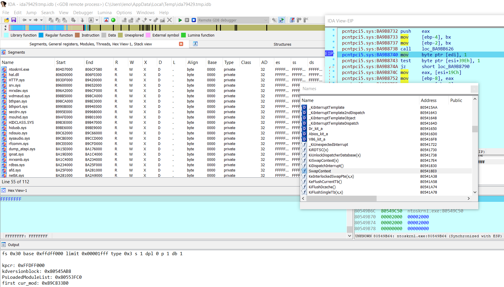

# ida_vmware_windows_gdb.py
Helper script for Windows kernel debugging with IDA Pro on VMware + GDB stub (including PDB symbols)

python3 + idapython 7.4



# Usage

**WARNING**: BEFORE OPEN IDA your must set env var: _NT_SYMBOL_PATH to windows symbols, ex: 
```
SRV*C:\winsymbols*
```` 

1. Open IDA PRO, start a debug session (go to Debugger -> Attach -> Remote GDB debugger)
2. File -> Script File -> ida_bochs_windows.py

Done!

More info:
- Advanced Windows Kernel Debugging with VMWare and IDA’s GDB debugger: https://hex-rays.com/blog/advanced-windows-kernel-debugging-with-vmware-and-idas-gdb-debugger/
- IDA Help Debugging with VMWare: https://hex-rays.com/products/ida/support/idadoc/1357.shtml

# Some possible problems

```
The crash is in ulm.c

Without more details, part of it means that I'm guessing here, but there's a very high probability that it stands for "User Level Monitor" as it does elsewhere whenever VMware mentions "ulm".

As such that means your VM is running on a host with Hyper-V mode enabled.

That codepath is pretty new and is most likely why you are getting this issue.
The most likely workaround would be to disable Hyper-V mode at the host level.
This might not be an option for you though.

If it is then the steps to disable the Hyper-V role is to run the following command at the host in windows command-line with Administrator privileges:

bcdedit /set hypervisorlaunchtype off
Reboot the system to activate it.

If you want to go back to Hyper-V mode again, then you can enable it like this:

bcdedit /set hypervisorlaunchtype auto
 

hope this helps,
```

- https://communities.vmware.com/t5/VMware-Workstation-Pro/Crash-after-resuming-execution-from-gdb-stub/td-p/2824667

## Demo video

https://youtu.be/q5MrGKqtmAg

## Related 

Helper script for Windows kernel debugging with IDA Pro on native Bochs debugger:
- https://github.com/therealdreg/ida_bochs_windows

Helper scripts for windows debugging with symbols for Bochs and IDA Pro (PDB files). Very handy for user mode <--> kernel mode:
- https://github.com/therealdreg/symseghelper

Helper script for Linux kernel debugging with IDA Pro on VMware + GDB stub (including some symbols helpers):
- https://github.com/therealdreg/linux_kernel_debug_disassemble_ida_vmware

## Credits

Based on original IDA-VMware-GDB By Oleksiuk Dmytro (aka Cr4sh) https://github.com/Cr4sh/IDA-VMware-GDB
